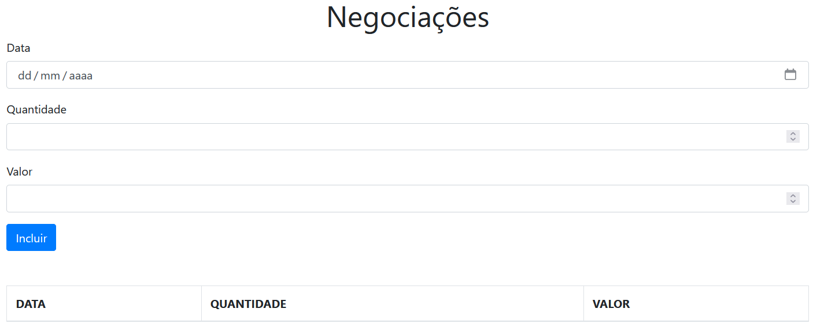
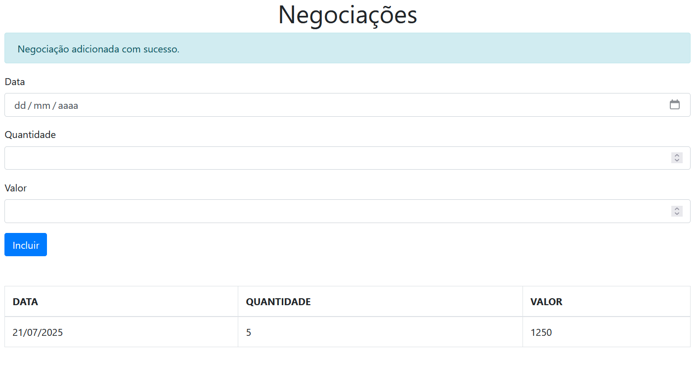
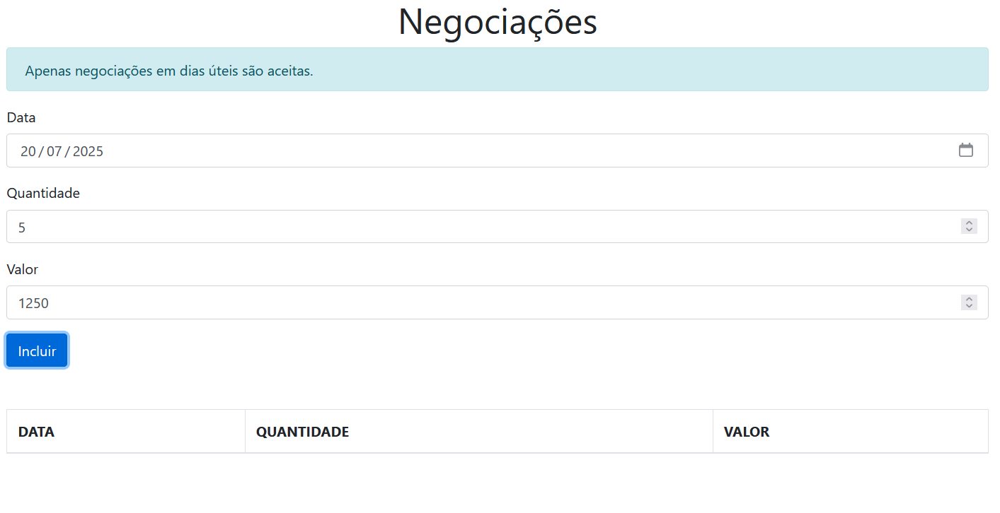

## 📈 Negociações

O **Negociações** é uma aplicação web em **TypeScript** que permite registrar operações financeiras de forma simples: insira **data, quantidade e valor**, clique em **“Incluir”** e veja cada negociação listada abaixo. Agora, com validações, uma **mensagem de erro** é exibida se o usuário tentar lançar em um dia não útil.

 

## 🚀 Sobre o Projeto

Este projeto foi desenvolvido durante o curso da Alura:

* "TypeScript parte 2: avançando na linguagem"

O sistema de registro financeiro evoluiu para usar **modificadores de acesso, herança, tipos genéricos e Enumerações**, além de criar um mini‑framework de **atualização de view** inspirado no JSX e otimizar a configuração do compilador TypeScript.

## 📚 Objetivos do Curso

* Aprender a utilizar **modificadores de acesso, herança e tipos genéricos**;
* Entender o papel das **Enumerations**;
* Criar um mini framework de **atualização de view** inspirado no JSX;
* Configurar ainda mais o compilador TS e tirar máximo proveito do código.

## 🛠️ Tecnologias Utilizadas

## 🖼️ Visualização do Projeto

Uma prévia das principais funcionalidades do **Negociações**:

**📝 Formulário de Negociações**

Campos para data, quantidade e valor, com botão “Incluir”.

**📊 Lista de Negociações**

As negociações são exibidas em uma tabela. Lançamentos em dia não útil geram uma mensagem de erro amigável.

**⚠️ Mensagem de Dia Não Útil**

Se o usuário tentar lançar uma negociação em um dia não útil, é exibida uma mensagem de erro clara e amigável.

